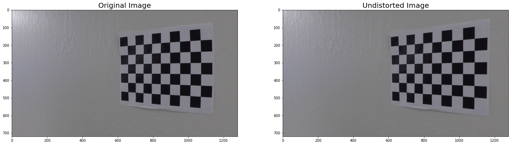
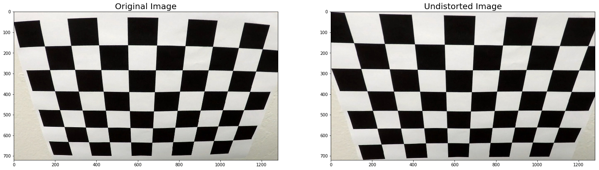
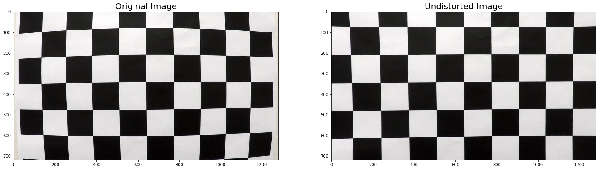
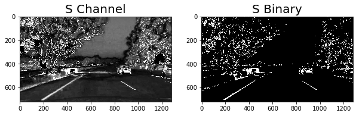
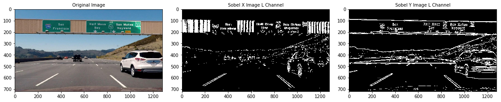
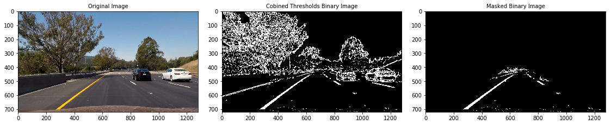

```{r setup, include=FALSE}
knitr::opts_chunk$set(echo = TRUE)
```


## Goal of this Project
The goal of this project to write a software pipeline to identify the lane boundaries in a video from a front-facing camera on a car. Use various techniques (described in detail below) to identify and draw the inside of a lane, compute lane curvature, and even estimate the vehicle's position relative to the center of the lane

## Image Distortion
Images taken using lens camera often suffer from image distortion. Image distortion occurs when a camera looks at 3D objects in the real world and transforms them into a 2D image; this transformation is not perfect. Distortion actually changes what the shape and size of these 3D objects appear to be. So, the first step in analyzing camera images, is to undo this distortion so that you can get correct and useful information out of them

*Following text is from lecture Notes*  


**Types of Distortion**  
Real cameras use curved lenses to form an image, and light rays often bend a little too much or too little at the edges of these lenses. This creates an effect that distorts the edges of images, so that lines or objects appear more or less curved than they actually are. This is called **radial distortion**, and it's the most common type of distortion.

Another type of distortion, is **tangential distortion**. This occurs when a camera's lens is not aligned perfectly parallel to the imaging plane, where the camera film or sensor is. This makes an image look tilted so that some objects appear farther away or closer than they actually are.


## Step1 : Find Chess Board Corners

We have learned that distortion changes the size and shapes of the object in an image. We will have to correct or calibrate this before performing any analysis.  
We can take pictures of any known shapes and detect the distortion errors. Ideal picture would be a chess board. A chess board is great for distortion correction because of its regular and high contrast pattern makes it easy to detect the distortion automatically.

**How do we use chess board to do distortion correction?**  
Take multiple images of chess board places against a flat surface from different angles and detect the distortion by looking at the difference between the size/shape of the squares in the images vs size/shape of the squares in the actual undistorted image.  Use this difference information to calibrate the images taken from the camera.  
In Short, map distorted points in a distorted chess image to undistorted points to un-distort any images.


## Step 2: Calibrate Camera and Distortion Correction
  

OpenCV function cv2.calibrateCamera() takes in image points,object points and shape of the input image. It calculates and returns the distortion coeffecients and the camera matrix that we need to transform 3D object points to 2D image points. It also returns the position of the camera in the world with values for rotation and translation vectors.  
Next step we need is to undistort an image. We can do this using OpenCV's cv2.undistort() function which takes in the image, camera matrix and distortion coeffecients and returns undistorted/ destination image.











### Test Undistortion on Car-Road Images


## Step 3: Explore Color Spaces
Explore different color spaces to see which color space and channels are most effective to separate lane lines.

We'll see how to do that in the following sections.

*Following text take from lecture notes*  
A color space is a specific organization of colors; color spaces provide a way to categorize colors and represent them in digital images.  

**RGB** is red-green-blue color space. You can think of this as a 3D space, in this case a cube, where any color can be represented by a 3D coordinate of R, G, and B values. For example, white has the coordinate (255, 255, 255), which has the maximum value for red, green, and blue.  

There are many other ways to represent the colors in an image besides just composed of red, green, and blue values.  

There is also **HSV** color space (hue, saturation, and value), and **HLS** space (hue, lightness, and saturation). These are some of the most commonly used color spaces in image analysis.  

To get some intuition about these color spaces, you can generally think of **Hue** as the value that represents color independent of any change in brightness. So if you imagine a basic red paint color, then add some white to it or some black to make that color lighter or darker -- the underlying color remains the same and the hue for all of these colors will be the same.  

On the other hand, **Lightness and Value** represent different ways to measure the relative lightness or darkness of a color. For example, a dark red will have a similar hue but much lower value for lightness than a light red. Saturation also plays a part in this; saturation is a measurement of colorfulness. So, as colors get lighter and closer to white, they have a lower saturation value, whereas colors that are the most intense, like a bright primary color (imagine a bright red, blue, or yellow), have a high saturation value. You can get a better idea of these values by looking at the 3D color spaces pictured below.  

Most of these different color spaces were either inspired by the human vision system, and/or developed for efficient use in television screen displays and computer graphics. You can read more about the history and the derivation of HLS and HSV color spaces [here](https://en.wikipedia.org/wiki/HSL_and_HSV).


#### Plot Images of each individual channel of RGB image ####
Explore thresholding individual RGB color channels. Take a look at them side by side to see which ones do a better job of picking up the lane lines.  
Observe that the Blue channel completely obscures the Yellow line on the left. Any thresholding you apply does a poor job on picking up the lanes.  
Red Channel does do a reasonable good job.


#### Let's examine Images of each individual channel of HLS image ####
At first look, S channel does an excellent job in picking up the lane lines. Experimenting with threshold values on this channel may yield interesting results.  
S channel does a fairly good job of picking up the lines under very different color and contrast conditions, while the other selections look messy. After experimenting with several thresholds, the range (180,255) gave us a good result.





## Step 4: Apply Color and Gradient Thresholds

### Sobel Threshold
Applying the Sobel operator to an image is a way of taking the derivative of the image in the x or y direction. You can read more about the Sobel operator [here](https://en.wikipedia.org/wiki/Sobel_operator).

Let's read an image and observe how sobel threshold applied in x and y orientations gives us different results. 
Our observations earlier helped us understand the individual channels in HLS image pick up lanes well and L&S channel do a good job of all. In this experiment, we'll use HLS's L&S channels to apply sobel operator.  





Taking the gradient in the x direction emphasizes edges closer to vertical. Alternatively, taking the gradient in the y direction emphasizes edges closer to horizontal.  

Threshold range 20 to 120 and kernel size of 5 seems to work well and L channel detects the lanes very well.  

1. In the first image, L channel was able to detect the lane curve which is far ahead.
2. Observe that in the second image, the shadows of the foot over bridge on the road are picked up in L channel's Y direction gradients. But S Channel combined with set thresholds was able to remove the shadow and detect only the lanes. 

L channel was able to pick up lane markings well (though with added noise like foot over bridge shadows). In the following sections, we learn how to combine these multiple characteristics and form a desired binary image with reduced noise and reasonable lane detections.
Moving forward, we'll use L channel to apply Magnitude and Direction gradients. 

### Magnitude of the Gradient
In the above images, you can see that the gradients taken in x direction was able to isolate lane lines very well.  
y-direction also picks up lanes well but adds some noise. Observe that the shadows of the foot over bridge on the road are picked up as well.  
To be able to use information in both the directions, You can now take the gradient in x or y directions and set thresholds to identify pixels within a certain gradient range.  The magnitude, or absolute value, of the gradient is just the square root of the squares of the individual x and y gradients.  

For a gradient in both the x and y directions, the magnitude is the square root of the sum of the squares.

Let's read an image and see how Gradient thresholds work. Threshold range 30 to 190, increased kernel size to 7 seems to work well and picks up all the lanes the vehicle is in.


###  Direction of the Gradient
*Text taken from Lecture notes*  
When you play around with the thresholding for the gradient magnitude in the previous exercise, you find what you might expect, namely, that it picks up the lane lines well, but with a lot of other stuff detected too. Gradient magnitude is at the heart of Canny edge detection, and is why Canny works well for picking up all edges.

In the case of lane lines, we're interested only in edges of a particular orientation. So now we will explore the direction, or orientation, of the gradient.  
The direction of the gradient is simply the inverse tangent (arctangent) of the y gradient divided by the x gradient. Each pixel of the resulting image contains a value for the angle of the gradient away from horizontal in units of radians, covering a range of -pi/2 to pi/2.  

An orientation of 0 implies a vertical line and orientations of +/- pi/2 imply horizontal lines. We'll take the absolute value of Sobel X, this restricts the values to +/- pi/2.

Let's read an image and see how Direction thresholds work. Threshold range 0.6 to 1.4 seems to work well combined with the kernel size  of 15.


###  Combining Thresholds
We can  now use various aspects of the gradient measurements (x, y, magnitude and direction) to isolate lane pixels. The idea is to combine the binary images generated using different thresholds using different gradient measurements.
After several experiments, following thresholds gave us good results:
1. Color threshold range between 180 and 255 applied on S channel of HLS image. 
2. Gradient threshold between the range 20 and 120 applied on L channel of HLS image. (on image with gradients taken in X direction). Kernel size used is 5.
3. Magnitude threshold between the range 30 and 190 applied on L channel of HLS image. Kernel size used is 7.
4. Direction threshold between the range 0.6 and 1.4 applied on L channel of HLS image.

**Combined Thresholds**
Gradients detected in X direction within the specified range OR Combined detections of gradients when Magnitude and Direction threshold applied OR Image after color thresholds applied.  

**Region of Interest**  
Before generating the final image, apply the region of interest to mask unnecessary details in the image. We are interested only in the portion of an image where lanes where the car is being driven are detected. Black our rest of the portion of the image.


**Final Images on the right side isolate lane lines**





## Step 4: Perspective Transform
In an image, perspective is the phenomenon that the object appears smaller the farther they are  from a viewpoint of a camera. And parallel lines appear to converge to point.

In this context, the lanes look smaller and smaller the farther away they get from the camera.
Perspective transform converts the 3D world's perspective of an image into 2D image representation.This process warps the image by dragging points towards or away from the camera.   
In this task, we transform the lane images into a bird's eye view representation. This is useful in making it easy to assess the curvature of the lane when looked from a bird's eye/ top down view of an image.


## Step 5: Build the pipeline
Build the pipeline to construct all the above steps in sequence to get the final warped image. Create the  
1. Undistort the image
2. Apply Color threshold range between 180 and 255 applied on S channel of HLS image.
3. Apply Gradient threshold between the range 20 and 120 applied on L channel of HLS image. (on image with gradients taken in X direction). Kernel size used is 5.
4. Apply Magnitude threshold between the range 30 and 190 applied on L channel of HLS image. Kernel size used is 7.
5. Apply Direction threshold between the range 0.6 and 1.4 applied on L channel of HLS image.
6. Combine Thresholds applied in steps 2 to 5 to get the final binary image
7. Apply perspective transform on the Binary image.
8. Final warped image along with the Mapping matrix to unwarp the image later


## Step 6: Locate Lane Lines

### 6.1 Peaks in  a Histogram
After applying calibration, thresholding, and a perspective transform to a road image, we now have a binary image where the lane lines stand out clearly. However, we still need to decide explicitly which pixels are part of the lines and which belong to the left line and which belong to the right line.

Computing a histogram along all the columns in the lower half of the image as shown below


### 6.2 Sliding Window
After plotting the histogram, we now have an idea on starting position of the pixels from the bottom of the image which may form a lane. Run a sliding window search to capture the pixel co-ordinates of the lane lines.

*Text from lecture Notes*  
With the histogram, we are essentially adding up the pixel values along each column in the image. In our thresholded binary image, pixels are either 0 or 1, so the two most prominent peaks in this histogram will be good indicators of the x-position of the base of the lane lines. So use that as a starting point for where to search for the lines.  
From that point, we can use a sliding window, placed around the line centers, to find and follow the lines up to the top of the frame.

### Visualize the result on test images


### 6.3 Continous polyfit
Now, we know where the lines are in the fit.  In the next frame of video we don't need to do a blind search again, but instead we can just search in a margin around the previous line position.


#### Lets now test it out on 2 continous frames of image


The green shaded area shows where we searched for the lines this time. So, once you know where the lines are in one frame of video, you can do a highly targeted search for them in the next frame. This is equivalent to using a customized region of interest for each frame of video, and should help us track the lanes through sharp curves and tricky conditions. If you lose track of the lines, go back to sliding_window_polyfit() search to rediscover them.

### Another Sliding Window Search
*Text below taken from Lecture Notes*  
Another way to approach the sliding window method is to apply a convolution, which will maximize the number of "hot" pixels in each window. A convolution is the summation of the product of two separate signals, in our case the window template and the vertical slice of the pixel image.

You slide your window template across the image from left to right and any overlapping values are summed together, creating the convolved signal. The peak of the convolved signal is where there was the highest overlap of pixels and the most likely position for the lane marker.

Now let's try using convolutions to find the best window center positions in a thresholded road image. The code below allows you to experiment with using convolutions for a sliding window search function. We gave it a try but this method is not used in this project


### 6.4 Measuring Curvature
Compute the radius of curvature of the fit using the following formulae.


### 6.4 Draw Lane and Data on Image


### 6.5 Track detections on continous stream of images
After creating the pipeline on test images, we'll run on a video stream, just like in the first project. In this case, we're going to keep track of things like where the last several detections of the lane lines were and what the curvature was, so we can properly treat new detections. To do this, it's useful to define a Line() class to keep track of all the interesting parameters measured from frame to frame.  
We can create an instance of the Line() class for the left and right lane lines to keep track of recent detections and to perform sanity checks.


#### Sanity Check
1. Checking that they have similar curvature
2. Checking that they are separated by approximately the right distance horizontally
3. Checking that they are roughly parallel


#### Reset
If sanity checks reveal that the lane lines detected are problematic for some reason, we can simply assume it was a bad or difficult frame of video, retain the previous positions from the frame prior and step to the next frame to search again. If you lose the lines for several frames in a row, start searching from scratch using a histogram and sliding window, to re-establish your measurement.

#### Smoothing
Even when everything is working, line detections will jump around from frame to frame a bit and it can be preferable to smooth over the last n frames of video to obtain a cleaner result. Each time we get a new high-confidence measurement, we can append it to the list of recent measurements and then take an average over n past measurements to obtain the lane position we want to draw onto the image.


### 6.6 Track detections on continuous stream of images
Build this final pipeline to track detections on continuous stream of images.

### Set Parameters

### 6.7 Combine Vehicle Detections
Use our Vehicle detection pipeline to detect both Lanes and Vehicles.


### 6.8 Test on Project Video


<video width="960" height="540" controls>
  <source src="Videos/project_video_output.mp4">
</video>


## Model Short comings: Potential points of Failure
The model perform reasonable well if the Road curvature and lighting conditions are constant. This model was not able to deliver good results at all on Harder challenge video. We can explore the following options to improve the pipeline:
1. Use LAB color space to apply Gradient and Direction thresholds.
2. Use convolutions instead of sliding windows to identify hot pixels
3. Use more advanced computer vision techniques to detect lanes while driving on extremely curvy roads.
