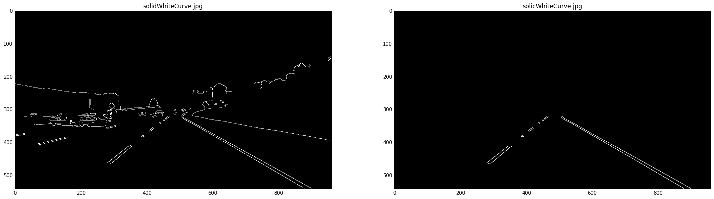

```{r setup, include=FALSE}
knitr::opts_chunk$set(echo = TRUE)
```

## Project Description

In this project, we plan to use Open Source - Computer Vision (OpenCV) tools to detect lanes on the road. To detect lanes, we need to construct a pipeline on a series on Individual images using tools from OpenCV's library and apply the result to a Video stream (which is again collection of images in sequence).
The final output would look similar to "raw-lines-example.mp4" video attached to this repository.

## OpenCV ?
Open CV (short for Open Source Computer Vision) is a library of programming functions mainly aimed at real time computer vision and Image processing. In this project, we'll utilize many such functions to construct our pipeline for detecting lanes on road images.
More information on [OpenCV](http://opencv.org/).


## Pipeline Construction
Pipeline is constructed using the following steps. 

1. **Grayscale Conversion**: Transform an image from BGR to Gray-scale format by using _cvtColor_ function.  

2. **Gaussian Blur**: Use Gaussian smoothing to suppress noise and spurious gradients.  

3. **Canny Edge Detection**: Detect edges using OpenCV's _cv2.Canny_ to detect edges in the image. This API requires Low and High thresholds for detecting strong edges above the higher threshold and reject pixels below the lower threshold. 
    + In this usecase, Low threshold = 70 and High threhold = 210 worked well.
    + Kernel size of 5 was used to Gaussian Blur.


4. **Capture Region of Interest**: Filter out unnecessary element from the image and retain an area which contains the lane projection. This can be done defining a poly-fit as our region of interest and mask the original image with the detected edges.    

After executing Steps 1 to 4, the original image is transformed as below.  Image on the bottom right does contain only the lanes which is the region of our interest to work on.  
  


5. **Hough Lines**: To find the lines in an image.  
    + To detect lines, we work on the masked edges and feed it to _cv2.HoughLinesP_ API.
    + The API will return the lines by end points (x1,y1,x2,y2) of all line segments detected by the Hough transform operation.  
    
6. **Draw Lines**: After the lines are detected using _HoughLinesP_, these lines are overlayed on the original image. This is a very key step to differentiate between Left vs Right lanes. I used the following steps:  
    + Lane lines are broken and can either be on the left or right side of the road.
    + Made use of the line end points given by _HoughLinesP_ to calculate the slope.
    + In this context, the origin of the image is on top left and the image space grows vertically down on y-axis and horizontally right on x-axis.  
    
    
    + Hence, if the slope between 2 points is calculated as positive and > 0.5, then the lines are most probably the left lanes. Alternatively is the slope is < -0.5, the lines are most probably right lanes. Use this logic to separate lanes (left Vs right).  
    
    
7. **Extrapolate Lines**: Lines are extrapolated to run the full length of the visible lane based on the line segments  identified with the Hough Transform.  
    + scipy library in python provides a very good implementation to calculate a least-squares regression for two sets of measurements.  
    + For each pair of points calculate the slope and intercept.
    + Use slope and intercept to regress points that connect two broken lanes. Draw lines on the main image using _cv2.line_ feeding these regressed points as inputs. 
    + Images below show Lines (left image) that are extrapolated and joined to run full length of the visible lane (Right Image).  
    
      

8. **Test on Videos**:  Apply the result of the algorithm to a Video stream.
  
  
  
## Potential Shortcomings
The pipeline constructed is not a fool-proof solution as you can see it did not perform well on the challenge video. There are a lot of other factors that need to be considered.  

1. The algorithm above works well if the rate of change of the road curvature is small. If rate of change of the road curvature  is high and the curves are sharp, the region of interest we used using poly fit has to be dynamic and should be extensively modified.  
2. The edge gradients on the images used are easy to detect. In real world scenario, the lighting conditions, shadows, trees, lanes with multiple colors, potholes, other traffic, road curves etc. will affect edge detection.  
3. Using the right parameters for Canny edge detection and Hough transform is very tricky and needs a lot of time to analyse the image.  
4. Can reflectors on the road interfere with the algorithm?  

## Possible Improvements
1. Convert all possible lane colors (Yellow) to White for better detection.  

2. Computer Vision combined with Deep learning Convolution Nets may help in detecting the lanes accurately. 
    
    
## Challenge Video
I am currently working on the challenge Video using these options:  

1. Shorten the region of interest.  

2. Convert Yellow shaded lanes to White.  

3. Use rolling window of slope and intercept for the last n frames to better detect the curvature.  

  

